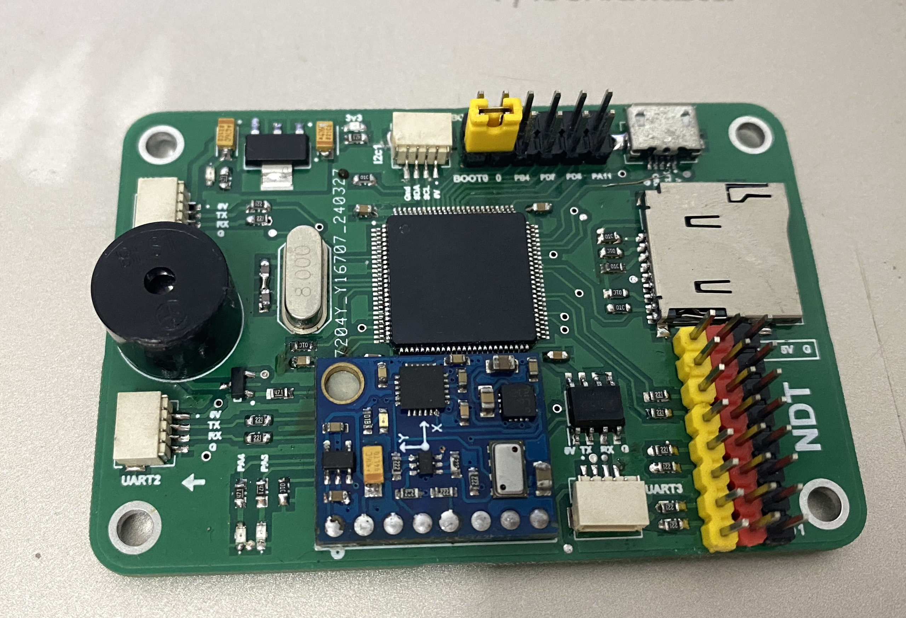

# ARMpilot
Flight controller design for fixed-wing uav
## Hardware
Flight controller board design with proteus
- 3 port uart
- 1 port I2C
- 6 pin PWM output
- 9 pin GPIO
- MCU stm32f103vct6
- mpu-6050
- hmc-5883 magnetic sensor
- ms-5611  baro
- SD card 
- 24HCxx Epprom ic

 
